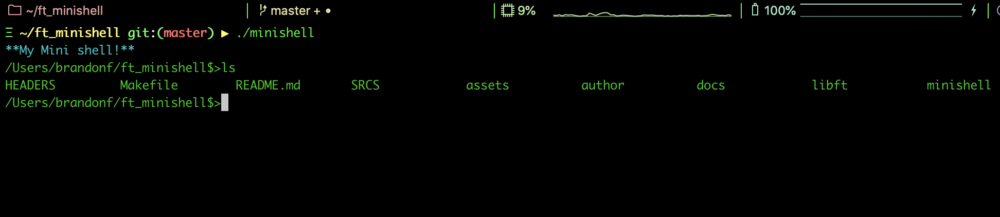

<p align="center">
  <div align="center">
   <br>
    <em><small><i>Shell unix command line interpreter .. but mini!</i></small></em>
  </div>
</p>

# Minishell

Minishell is a simple unix command line interpreter, including several built in shell functions. Such as:

* echo
* cd
* env
* setenv
* unsetenv
* exit

Additional features:

- Signal handling(ctrl-C, ctrl-D).
- Colors.
- Multi command support(separated by `;`).
- Advanced quotes support. Weak/strong quotes expantion. Managing correct quotes input.
- Using errno for correct error management.

Per the project, all of our functions must begin with ```ft_``` for, _Forty-Two_.

**Project Document:**
[Minishell.pdf](https://github.com/elloimbrandon/ft_minishell/blob/master/docs/minishell.en.pdf)

All functions were written according to 42's coding standard,
[the Norm](https://github.com/elloimbrandon/ft_minishell/blob/master/docs/norme.en.pdf).


## Installation

Download the repository by copying and pasting the commands below.

```bash
git clone https://github.com/elloimbrandon/ft_minishell.git

```

You can compile the library and executable using the Makefile:

Command       |  Action
:-------------|:-------------
`make`        | Compile the library.
`make clean`  | Remove object files.
`make fclean` | Remove object files and the library.
`make re`     | Re-compile the library.


## Usage

After compilation, run executable.

```bash
./minishell
```



Command       |  Action
:-------------|:-------------
`cd`          | Change directories.
`echo`        | Write arguments to the standard output.
`env`         | Print environment.
`setenv`      | Set environment variable.
`unsetenv`    | Un-set environment variable.
`exit`        | exit minishell.
